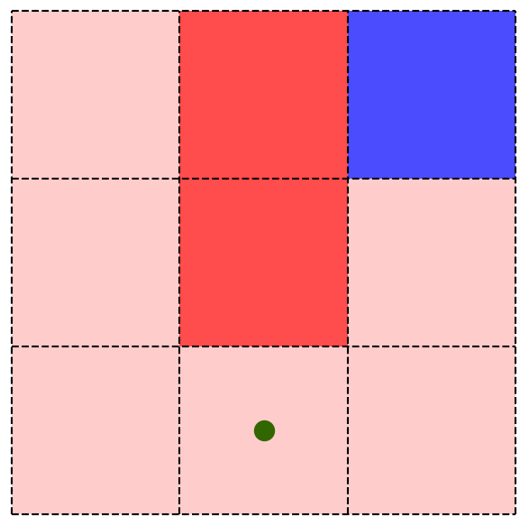

# Q-Learning - Pitfalls path (V1.0)

This project presents a personal implementation of the **Q-Learning** algorithm from the **Reinforcement Learning** field. The goal of this little game for the agent is to reach the objective by following the right path and avoiding pitfalls. I used a Q-table and the epsilon greedy algorithm to balance the agent behaviour between exploration and exploitation of the environment states.

To launch the program and watch the agent execute episodes and learn by itself :  
```
python path.py
```

The program shall draw a grid with an obective and pitfalls, and the agent tries, iteratively through episodes, to discover the policy of the right path :  

